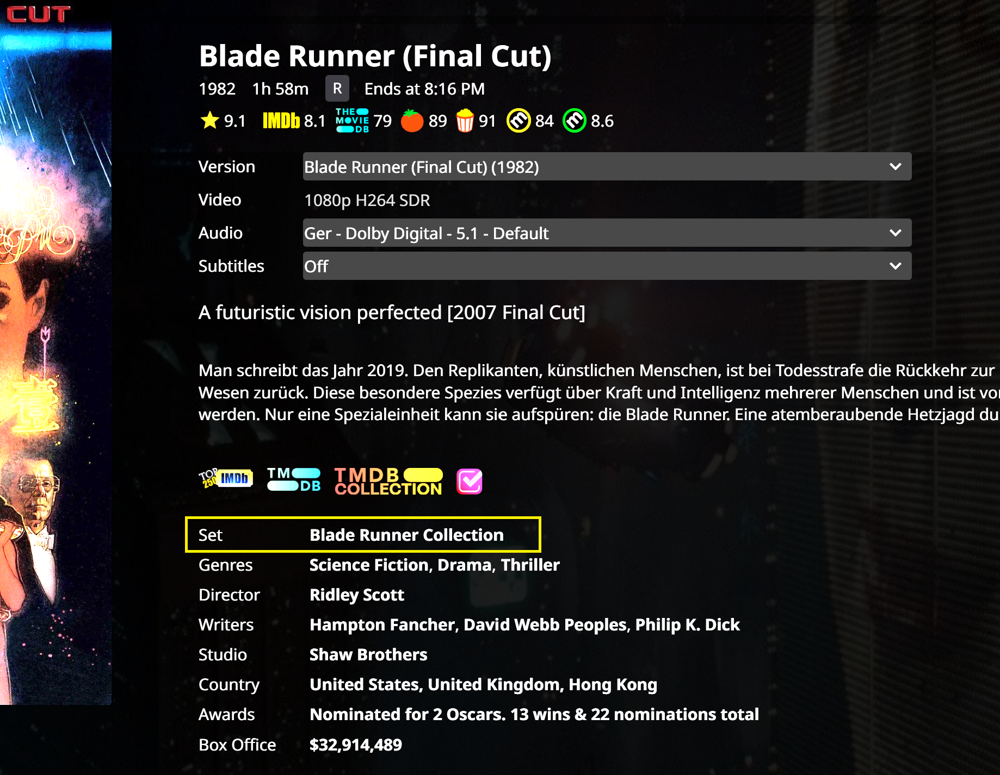

Note: This script is compatible with [Jellyfin DetailsGroupItems Extended](https://github.com/chrissix666/Jellyfin-DetailsGroupItems-Extended).

# Jellyfin DetailsGroupItems Sets/Collections

For **Jellyfin Web**, works with **JavaScript Injector**.

One practical feature missing from Jellyfin is the ability to quickly navigate from a movie directly to its Collection/Box Set and back again. This script adds a configurable **Collection/Set** row to the **DetailsGroupItems** section, allowing direct navigation to the corresponding Jellyfin Box Set.

The Collection row is injected into the native **DetailsGroupItems** area and fully matches Jellyfin's original appearance and behavior. Font weight, spacing, hover effects, link styling, and interaction behavior are adjusted so the injected row integrates seamlessly and is visually indistinguishable from the native entries.

The Collection row is only displayed when the movie belongs to an existing Jellyfin Box Set. This requires a valid TMDb Collection/Box Set association to be present in the movie metadata. Movies that are not part of a Collection will not display the row.

---

## Features

- Adds a Collection/Set row to movie DetailsGroupItems
- Direct navigation from a movie to its Jellyfin Box Set
- Supports multiple collections if available
- Configurable label text
- Optional collection name replacement rules
- Configurable row positioning
- Supports positioning relative to native DetailsGroupItems rows
- Compatible with Jellyfin DetailsGroupItems Extended rows
- Session-based caching for improved performance

---

## Configuration

The script can be customized through the `CONFIG` section.

### Label Text

The displayed label can be changed to any preferred naming convention.

Examples:

- Collection
- Set
- Saga
- Film Series

### Collection Name Replacement Rules

Optional phrase replacement rules can automatically convert localized TMDb naming conventions before display.

Examples:

- Alien Filmreihe → Alien Collection
- Rocky Filmreihe → Rocky Collection

This only affects the displayed text and does not modify Jellyfin metadata or Box Set names.

### Row Position

The Collection row can be displayed:

- At the top of DetailsGroupItems
- After a selected metadata row
- At the end of DetailsGroupItems

Supported native target rows:

- Genres
- Director
- Writer
- Studio

When used together with Jellyfin DetailsGroupItems Extended, the Collection row can also be positioned relative to:

- Country
- Awards
- Box Office

### Clickable Navigation

Collection names can be clicked to open the corresponding Jellyfin Box Set directly.

---

## Installation

- Intended for **Jellyfin Web**
- Requires a **JavaScript Injector** (e.g. Jellyfin JavaScript Injector plugin or userscript manager)
- Paste the script into the injector
- Configure to your needs
- Save and reload the Jellyfin Web interface

---

## Tested on

- Windows 11
- Chrome
- Jellyfin Web 10.10.7
- Jellyfin JavaScript Injector

---

## License

MIT
